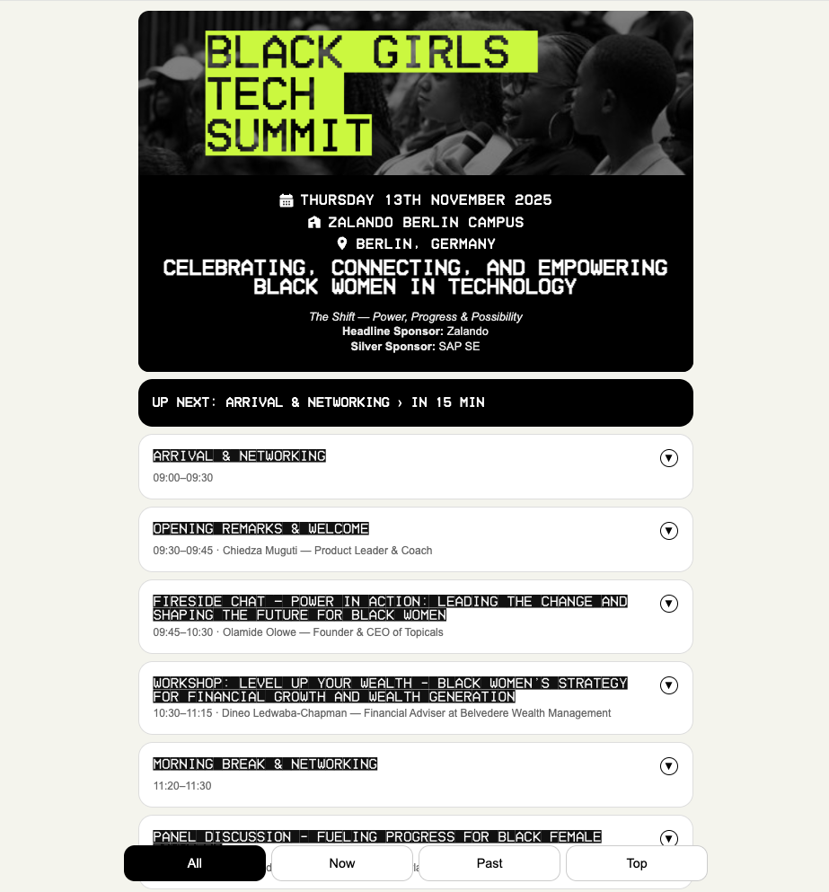
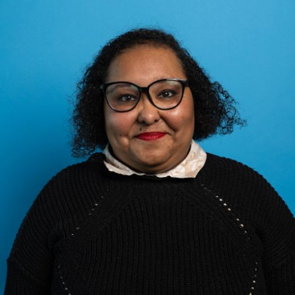

  
  

# 🖤 **Black Girls Tech Summit 2025 — Live Schedule** 🖤

This simple website was created to help attendees follow the **Black Girls Tech Summit 2025: The Shift — Power, Progress & Possibility** in real time.  
It highlights the session currently taking place and greys out past ones, making it easier to keep track of what’s happening throughout the day — even offline.

---

## About the Project

This is a small front-end project built with **HTML**, **CSS**, and **JavaScript**, without any backend or commercial purpose.  

It was made as a learning exercise and a community contribution — to be useful during the event and to showcase practical skills learned at **ReDI School of Digital Integration**, where I completed the **Full-Stack Web Development Bootcamp**.

I’m currently attending the 2025 **Black Girls Tech Summit** as a participant, not an organiser or sponsor.  
This project is entirely **independent** and **non-commercial**.

---

## Features

- Mobile-first design  
- Offline-ready  
- Live “Now” and “Up Next” highlighting  
- Simple navigation between sessions  

---

## Author

  

**Lilian Rodrigues**  
- Aspiring Front-End · Back-End · Full-Stack Developer
- ReDI School Full-Stack Development Alumna — Berlin, Germany
- **LinkedIn** ([https://www.linkedin.com/in/lilian-rodrigues-berlin]
